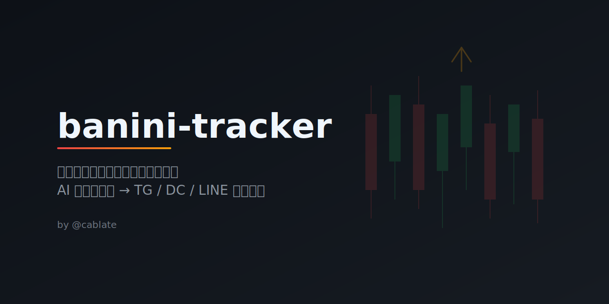

<p align="center">
  
</p>

# banini-tracker

追蹤「反指標女神」巴逆逆（8zz）的 Threads / Facebook 貼文；系統會持續巡檢，一抓到新貼文就立刻做 AI 反指標分析，並推送到 Telegram / Discord / LINE。

## 它做什麼

1. 透過 Apify 抓取巴逆逆的最新社群貼文（Threads + Facebook）
2. 自動去重，只處理新貼文
3. 用 LLM 進行「反指標 + 總經連鎖」分析
4. 將分析結果同步推送到 Telegram / Discord / LINE
5. 內建即時輪詢模式：作者一發文，系統下一輪檢查就會直接推送
6. 額外提供 TradingView Pine Script 指標，方便把巴逆逆訊號手動標到 K 線圖上

## 反指標邏輯

巴逆逆被稱為「股海冥燈」——買什麼跌什麼，賣什麼漲什麼。AI 分析會：

- 辨識她提到的標的（個股、ETF、原物料）
- 判斷她的操作（買入 / 被套 / 停損）
- 反轉推導（她停損 → 可能反彈、她買入 → 可能下跌）
- 推導連鎖效應（油價跌 → 製造業利多 → 電子股受惠）

## 環境需求

- Node.js 20+
- [Apify](https://apify.com/) 帳號（免費額度即可）
- 任何 OpenAI 相容的 LLM API（預設 DeepInfra）
- Telegram Bot + 頻道（選用）
- Discord Webhook（選用）
- LINE Messaging API Channel（選用）

## 安裝

```bash
git clone https://github.com/CabLate/banini-tracker.git
cd banini-tracker
npm install
cp .env.example .env
```

編輯 `.env` 填入你的 API keys：

```env
APIFY_TOKEN=your_apify_token
LLM_BASE_URL=https://api.deepinfra.com/v1/openai
LLM_API_KEY=your_api_key
LLM_MODEL=MiniMaxAI/MiniMax-M2.5
TG_BOT_TOKEN=your_telegram_bot_token
TG_CHANNEL_ID=your_telegram_channel_id
DISCORD_WEBHOOK_URL=your_discord_webhook_url
LINE_CHANNEL_ACCESS_TOKEN=your_line_channel_access_token
LINE_TO=your_line_user_or_group_id
REALTIME_CRON=*/5 * * * *
REALTIME_MAX_POSTS=3
```

## 使用

### 手動執行

```bash
npm run dev              # Threads + FB 各 3 篇，AI 分析 + 通知
npm run dry              # 只抓取，不呼叫 LLM（測試用）
npm run market           # 盤中模式：FB only, 1 篇
npm run evening          # 盤後模式：Threads + FB, 各 3 篇
```

### 常駐排程（部署用）

```bash
npm run build            # TypeScript 編譯
npm run start            # 啟動常駐排程
```


你也可以自行調整：

```env
REALTIME_CRON=*/10 * * * *   # 改成每 10 分鐘輪詢一次
REALTIME_MAX_POSTS=5         # 每輪最多抓 5 篇，避免漏掉連發貼文
```

> 注意：輪詢越頻繁，Apify 與 LLM 成本就越高；想省錢就把 `REALTIME_CRON` 拉長一點。

## TradingView 指標

專案現在附了一份 TradingView Pine Script：

```text
tradingview/banini-reverse-indicator.pine
```

這個指標的用途不是自動抓巴逆逆貼文，而是讓你把本專案推送出來的訊號，**手動標到 TradingView 圖表上**。  
原因很簡單：TradingView 的 Pine Script 不能直接去抓 Threads / Facebook，所以最實際的做法是：

1. 先用這個專案追蹤巴逆逆貼文
2. 看到通知後，確認她的動作（買進、加碼、停損、被套…）
3. 把對應的時間與動作填進 TradingView 指標
4. 在 K 線圖上觀察後續幾根 K 棒的走勢

### 指標提供什麼功能

- 一次可設定 5 組訊號槽位
- 依照巴逆逆動作，自動換算成反指標偏多 / 偏空
- 可設定高 / 中 / 低信心強度
- 可設定訊號延伸觀察區（例如往後看 20 根 K 棒）
- 會在圖上畫出標籤、觀察區與摘要表
- 可建立 5 組對應的 TradingView Alert

### 動作對照表

| 巴逆逆動作 | 指標解讀 |
| --- | --- |
| 她停損 / 賣出 | 反指標偏多 |
| 她認錯 / 畢業 | 反指標偏多 |
| 她買進 / 加碼 | 反指標偏空 |
| 她看多 / 抄底 | 反指標偏空 |
| 她被套 / 繼續抱 | 反指標偏空 |
| 觀望 / 不明 | 中性觀察 |

## TradingView 超詳細操作教學

下面這段是給沒用過 Pine Script、也不熟 TradingView 的人。

### 1. 打開 TradingView 圖表

1. 登入 [TradingView](https://www.tradingview.com/)
2. 打開你要觀察的商品，例如台股、ETF、期貨、比特幣都可以
3. 進入完整圖表頁面

> 建議先把圖表切到你常用的週期，例如 5 分鐘、1 小時、日線；因為「訊號延伸幾根 K 棒」會跟目前圖表週期直接相關。

### 2. 開啟 Pine Editor

1. 在圖表下方找到 **Pine Editor**
2. 點進去之後，先把原本範例程式全部清掉
3. 打開本專案裡的 `/tradingview/banini-reverse-indicator.pine`
4. 把整份程式完整貼進 Pine Editor

### 3. 存檔並加入圖表

1. 在 Pine Editor 右上角按 **Save**
2. 名稱可以填：`8zz Banini Reverse Indicator`
3. 再按 **Add to chart**

如果沒有報錯，代表指標已經成功加到圖上。

### 4. 先把 TradingView 時區調成台北時間

因為巴逆逆貼文通常是用台灣時間在看，所以建議把圖表時區也改成 **Asia/Taipei / UTC+8**。

做法通常是：

1. 看圖表右下角目前的時區
2. 點下去
3. 改成 `Asia/Taipei` 或 `UTC+8`

這樣你在填「貼文 / 事件時間」時，比較不會對錯時間。

### 5. 打開指標設定

1. 在圖表上找到剛剛加進去的指標
2. 點它旁邊的齒輪
3. 你會看到幾個區塊：
   - `顯示設定`
   - `訊號 1`
   - `訊號 2`
   - `訊號 3`
   - `訊號 4`
   - `訊號 5`

### 6. 先調整「顯示設定」

你最先該看的是：

- `訊號延伸 K 棒數`：訊號出現後，要往後觀察幾根 K 棒  
  例如：
  - 5 分鐘圖填 12 = 往後觀察約 1 小時
  - 日線圖填 5 = 往後觀察 5 個交易日
- `顯示訊號觀察區`：打開後，圖上會出現淡色區塊
- `顯示右上角摘要表`：右上角會顯示目前偏多 / 偏空分數
- `反指標偏多顏色` / `反指標偏空顏色`：你可以改成自己習慣的顏色

### 7. 把通知內容填進訊號槽位

假設本專案通知你：

- 時間：2026-04-10 09:15
- 她的操作：停損賣出
- 反指標：可能反彈上漲
- 信心：高

那你就在某一個空的訊號槽位填：

1. `啟用`：打開
2. `貼文 / 事件時間`：填 2026-04-10 09:15
3. `巴逆逆動作`：選 `她停損 / 賣出（反指標偏多）`
4. `信心強度`：選 `高`
5. `備註`：可以填 `FB 停損文`、`Threads 盤中發文` 之類

填好後，圖上會在對應時間附近出現標籤，並把後續觀察區標出來。

### 8. 看懂圖上的東西

- **綠色 / 偏多色**：代表巴逆逆這次行為，被你歸類成「反指標偏多」
- **紅色 / 偏空色**：代表這次行為被歸類成「反指標偏空」
- **標籤**：顯示是第幾組訊號、她做了什麼、這次的反指標方向
- **虛線**：標示訊號出現當下的大概價位
- **淡色區塊**：代表你設定的觀察 K 棒期間
- **右上角摘要表**：把目前還在觀察窗內的訊號加總成一個分數
  - 正分：目前偏多
  - 負分：目前偏空
  - 0：中性

### 9. 超過 5 筆訊號怎麼辦

有 3 種做法：

1. 把舊訊號關掉，換填新訊號
2. 再加第二個同樣的指標到圖表上
3. 只保留你最在意的幾筆事件（例如停損、畢業文、超高情緒文）

如果你平常只看近期訊號，第一種通常就夠了。

### 10. 怎麼在 TradingView 建 Alert

這個腳本已經內建 5 組 alert condition。

設定方式：

1. 圖表上方按 **Alert**
2. 條件選擇這個指標
3. 再選：
   - `8zz 訊號 1 觸發`
   - `8zz 訊號 2 觸發`
   - `8zz 訊號 3 觸發`
   - `8zz 訊號 4 觸發`
   - `8zz 訊號 5 觸發`
4. 設定你要的通知方式（App / Email / Webhook）
5. 按建立

注意：這些 Alert 是在你填好的訊號時間被圖表走到時觸發，不是自動幫你抓社群貼文。

### 11. 最推薦的實際使用流程

如果你是要把這個 repo 跟 TradingView 搭起來一起用，最順的流程是：

1. 先讓本專案跑起來，接 Telegram / Discord / LINE 通知
2. 一收到巴逆逆新貼文分析，就看：
   - 她的操作
   - 反指標方向
   - 信心高低
   - 發文時間
3. 打開 TradingView，把這筆訊號填進空的槽位
4. 觀察後續幾根 K 棒是否真的符合反指標邏輯
5. 用幾週時間累積你的「巴逆逆事件庫」

### 12. 常見問題

#### 為什麼不能自動把 Threads / Facebook 貼文直接灌進 TradingView？

因為 Pine Script 不能直接抓這些網站資料，也不能直接讀這個專案輸出的本地 JSON。

#### 為什麼我填了時間，標籤跑到隔壁 K 棒？

因為 TradingView 會把事件掛在「第一根大於等於你設定時間」的 K 棒上，這是正常的。  
如果你很在意精準度，請把圖表切到更小週期。

#### 為什麼右上角分數沒有變？

因為只有「還在觀察窗內」的訊號才會被計分。  
超過你設定的 `訊號延伸 K 棒數` 之後，舊訊號就只留標記，不再影響目前分數。

## 超詳細新手教學（給程式笨蛋）

如果你平常幾乎沒碰過程式，也可以照下面做。

### 1. 先準備好 4 樣東西

1. 一台可以上網的電腦（Windows / macOS 都可以）
2. [Node.js 20 以上](https://nodejs.org/)
3. 一個 [Apify](https://apify.com/) 帳號
4. 一個 OpenAI 相容 LLM API Key（例如 DeepInfra）

安裝 Node.js 時，直接去官網下載 **LTS 版本**，一路按下一步即可。

### 2. 把專案抓到你的電腦

如果你有安裝 Git：

```bash
git clone https://github.com/CabLate/banini-tracker.git
cd banini-tracker
```

如果你沒有安裝 Git，也可以在 GitHub 頁面按 **Code → Download ZIP**，下載後解壓縮，再用終端機切到該資料夾。

### 3. 安裝專案需要的東西

在專案資料夾執行：

```bash
npm install
```

看到安裝完成就可以。

### 4. 建立你的設定檔

執行：

```bash
cp .env.example .env
```

然後用記事本、VS Code 或任何文字編輯器打開 `.env`。

### 5. 先填最基本的 3 個欄位

```env
APIFY_TOKEN=你的 Apify Token
LLM_API_KEY=你的 LLM API Key
LLM_MODEL=MiniMaxAI/MiniMax-M2.5
```

- `APIFY_TOKEN`：登入 Apify 後到設定頁面建立
- `LLM_API_KEY`：你購買或申請的模型平台金鑰
- `LLM_MODEL`：如果你不知道要填什麼，就維持預設值

### 6. 想推送到哪裡，就填哪一組通知

#### Telegram

你需要：

1. 跟 `@BotFather` 建立一個 Bot
2. 拿到 Bot Token
3. 把 Bot 加進你的頻道或群組
4. 找到頻道 / 群組 ID

填入：

```env
TG_BOT_TOKEN=你的 Telegram Bot Token
TG_CHANNEL_ID=你的頻道或群組 ID
```

#### Discord

你需要：

1. 打開 Discord 伺服器設定
2. 進入 **整合 → Webhooks**
3. 建立一個新的 Webhook
4. 複製 Webhook URL

填入：

```env
DISCORD_WEBHOOK_URL=你的 Discord Webhook URL
```

#### LINE

你需要：

1. 到 [LINE Developers](https://developers.line.biz/) 建立 Messaging API Channel
2. 取得 Channel access token
3. 讓 Bot 加入你要接收通知的聊天室
4. 找到接收目標 ID（使用者、群組或聊天室 ID 都可以）

填入：

```env
LINE_CHANNEL_ACCESS_TOKEN=你的 LINE Channel Access Token
LINE_TO=接收通知的使用者或群組 ID
```

### 7. 先做一次測試

```bash
npm run dry
```

這一步只會抓資料，不會送去做 AI 分析，適合先確認抓文流程有沒有壞掉。

如果你想直接測完整流程：

```bash
npm run dev
```

### 8. 開啟「作者一發文就推送」模式

```bash
npm run build
npm run start
```

系統會持續在背景依照 `REALTIME_CRON` 設定巡檢；預設每 5 分鐘檢查一次，有新貼文就立刻推送。

### 9. 想讓它更快或更省錢

修改 `.env`：

```env
REALTIME_CRON=*/5 * * * *    # 更快，幾乎即時，但比較花 API 額度
REALTIME_CRON=*/15 * * * *   # 比較省錢，但通知會慢一些
REALTIME_MAX_POSTS=3
```

### 10. 常見問題

#### 沒收到通知

- Telegram：確認 Bot 有加入頻道，而且有發文權限
- Discord：確認 Webhook URL 沒貼錯
- LINE：確認 Bot 有加入聊天室，而且 `LINE_TO` 是正確的目標 ID

#### 執行後直接報錯

先看你是不是少填這些欄位：

- `APIFY_TOKEN`
- `LLM_API_KEY`
- 至少一組通知設定

#### 有抓到貼文但沒分析內容

可能是：

- 該篇貼文是純圖片
- LLM API 暫時失敗

這種情況下，系統仍然會直接把原文連結推送出去，不會整批靜悄悄消失。

## 專案結構

```
src/
  index.ts       # 主程式 + 排程邏輯
  threads.ts     # Apify Threads Scraper 封裝
  facebook.ts    # Apify Facebook Scraper 封裝
  analyze.ts     # LLM 反指標分析（prompt + 呼叫）
  telegram.ts    # Telegram Bot 通知
  discord.ts     # Discord Webhook 通知
  line.ts        # LINE Messaging API 推送
  report.ts      # 各平台共用的通知內容格式化
tradingview/
  banini-reverse-indicator.pine  # TradingView Pine Script 手動標註指標
data/            # 執行資料（gitignore）
  seen.json      # 已處理貼文 ID（去重用）
  report-*.json  # 每次分析結果存檔
```

## 免責聲明

本專案僅供娛樂參考，不構成任何投資建議。
